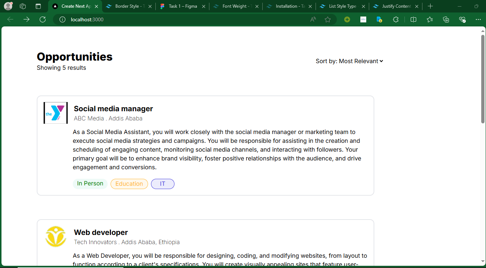
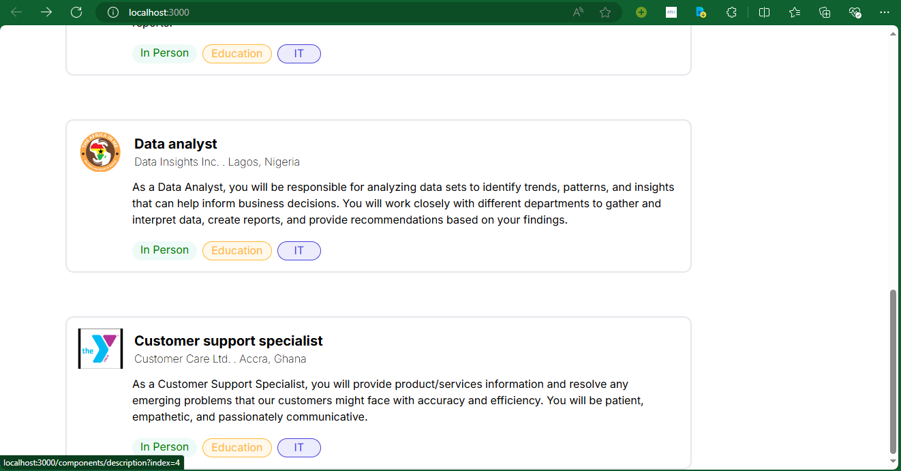
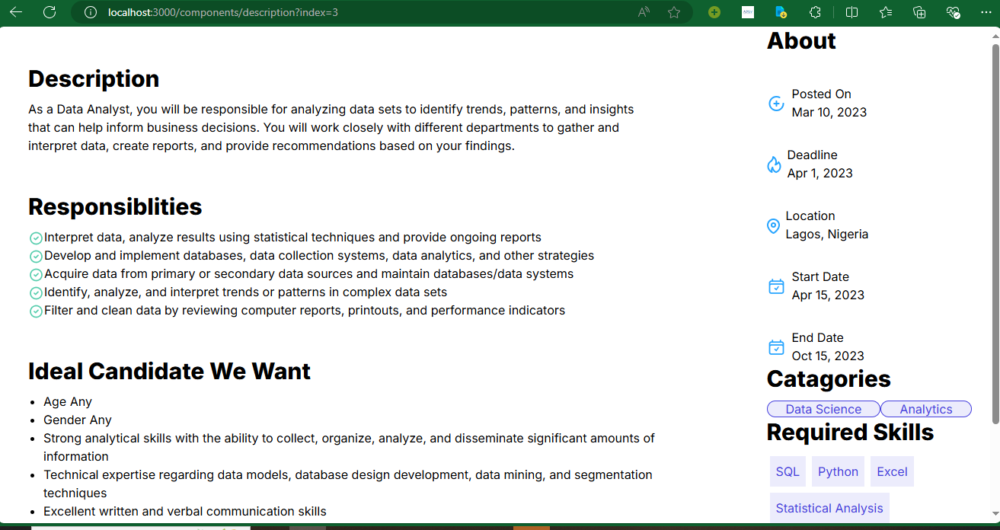
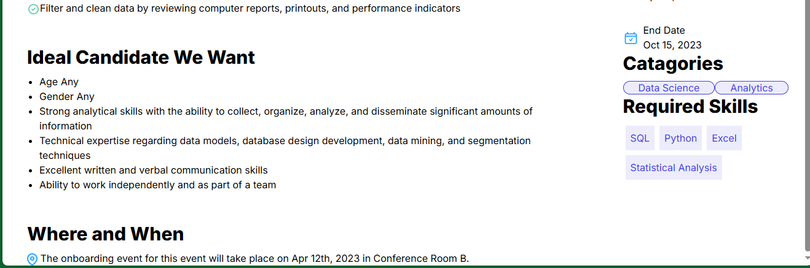

# Simple Job Listing next app

A simple next job listing app

## Features

- list jobs from a json data
- show detail of a given job

## Installation

1. Clone the repository
2. Install dependencies: `npm install`
3. Start the development server: `npm run dev`

## ScreenShots

