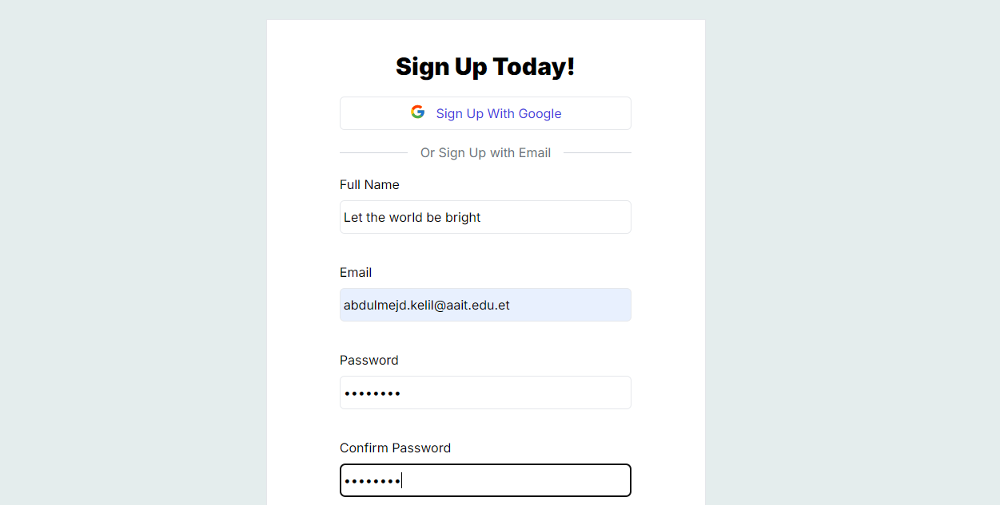
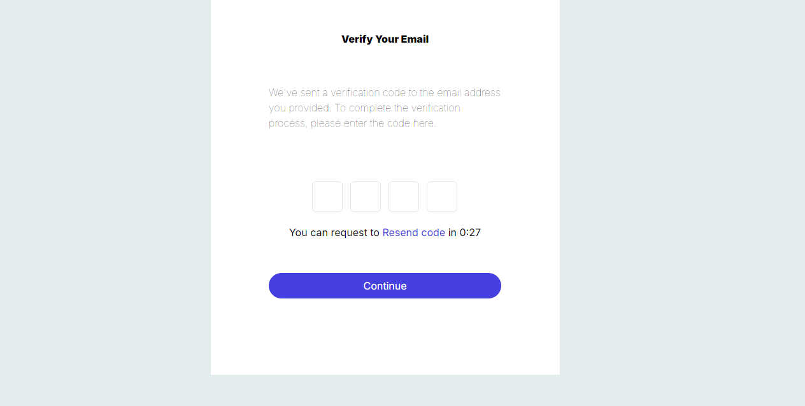
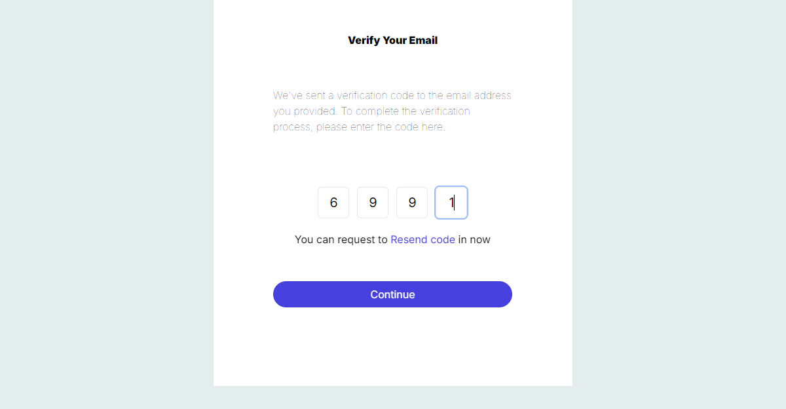
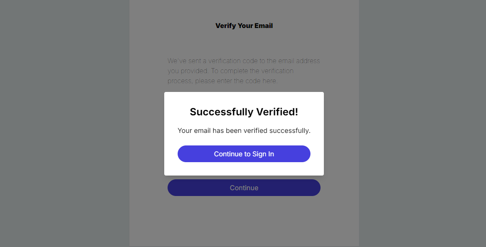
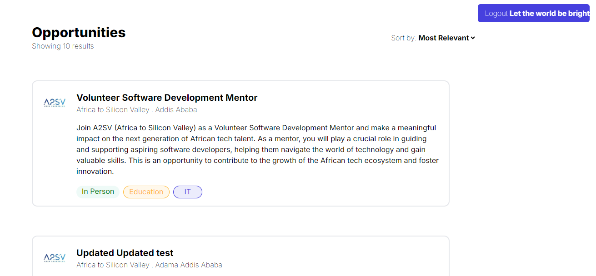
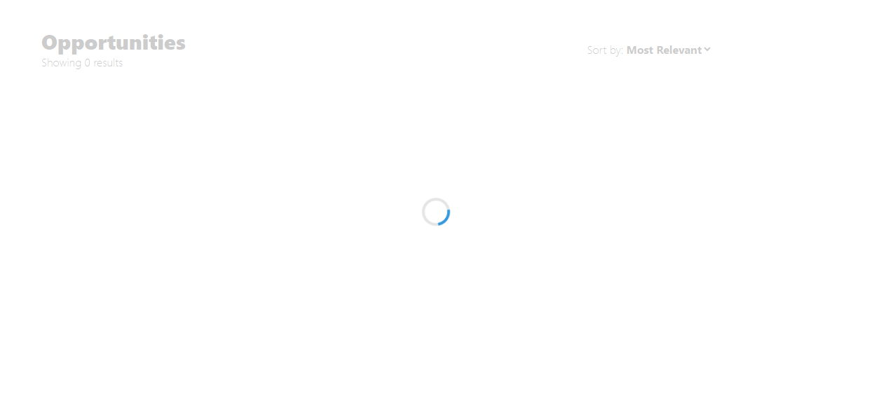
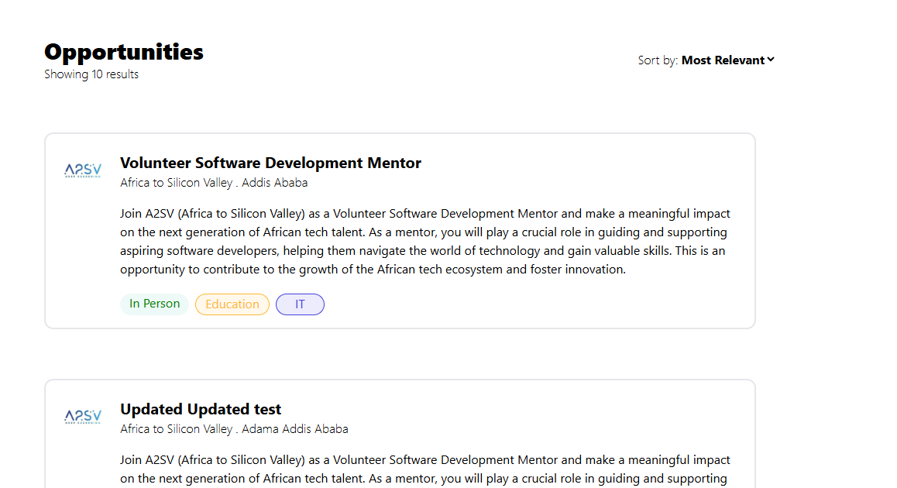
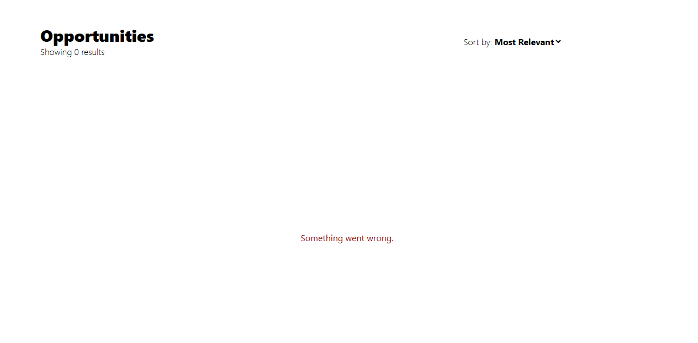
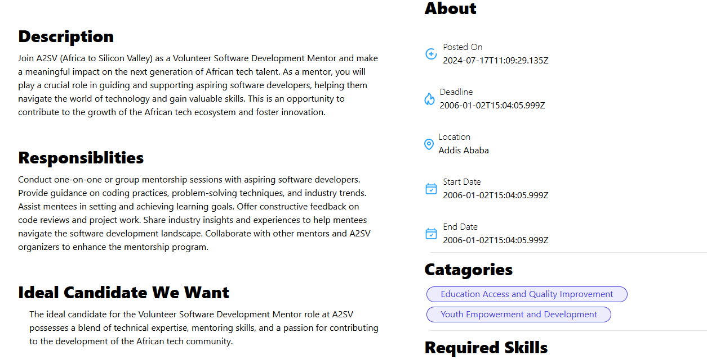

# Simple Job Listing App

A simple job listing application built with Next.js that fetches job data from a backend JSON file using Redux Toolkit Query (RTK Query) and user Authentication and Authorization using nextAuth and react hook form for form validation. The app allows users to view a list of available jobs and see detailed information about each job.

## Features

- **Job Listings**: Fetch and display a list of available jobs using RTK Query.
- **Job Details**: View detailed information about a specific job by clicking on a job listing.

## Installation

1. **Clone the repository**:
   ```
   git clone https://github.com/your-repo-url.git
   ```
2. **Install dependencies**:
   ```
   npm install
   ```
3. **Start the development server**:
   ```
   npm run dev
   ```

## Screenshots

### 1. Signup Page


_The initial signup page where users can create a new account by entering their details._

### 2. Verification Page


_After signing up, users are directed to the verification page to enter the OTP sent to their email._

### 3. OTP Filled


_An example of the OTP input fields filled with the verification code._

### 4. Verified Modal


_A modal that appears after successful verification, indicating that the user's email has been verified._

### 5. Sign-In Page


_The sign-in page where users can log in with their credentials._

### 6. Main Page (Job Listings)


_The main job listing page displaying all the available job opportunities._

### 7. Loading State


_The loading state shown while fetching job data from the backend._

### 8. Loaded State


_The page after the job data has been successfully loaded and displayed._

### 9. Error State


_An error state that appears if there is an issue retrieving job data._

### 10. Job Detail Page


_The job detail page showing in-depth information about a specific job selected from the listings._
